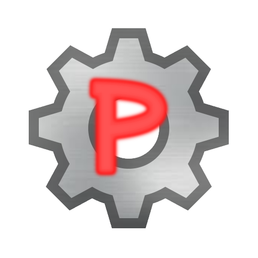

# Photon Launcher

A ⚡ <strong style="color: yellow">blazingly fast</strong> ⚡, 🎮 game-changing 🎮 launcher for <a href="https://blendi-goose.itch.io/photon" style="color: red">Photon</a> written in <a href="https://flutter.dev">Flutter</a>

# How does it work?

We get some data from <a href="https://PhotonVersionRepo.bledniappel.repl.co" style="color: darkred">the backend</a>.
After that, we decode the info using `dart:convert` and display to the user ⚡ <strong style="color: yellow">blazingly fast</strong> ⚡ the versions available according to <a href="https://PhotonVersionRepo.bledniappel.repl.co" style="color: darkred">the backend</a>. After that, you select one, and either download (using <a href="https://pub.dev/packages/dio">Dio</a>) the version, or directly play from cache.

# How fast is it?

Sub-20ms render times and sub-500ms launch times. 
We call that ⚡ <strong style="color: yellow">blazingly fast</strong> ⚡
